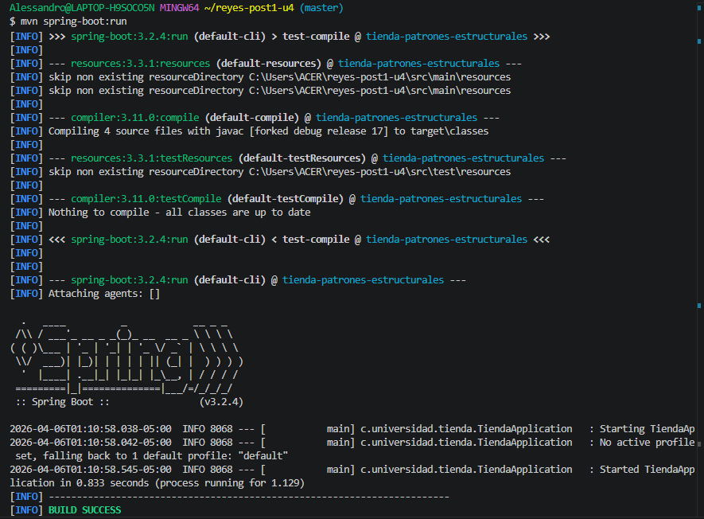

# Sistema de Pedidos - Unidad 4 (Chain of Responsibility y Command)

Proyecto Java con Spring Boot para practicar patrones de diseno orientados a desacoplar validaciones y operaciones reversibles en un flujo de pedidos.

## Objetivo

Implementar un flujo de procesamiento de pedidos aplicando:

- Chain of Responsibility para validaciones encadenadas.
- Command para encapsular acciones y permitir deshacer operaciones.

## Patrones implementados

### 1. Chain of Responsibility (COR)

Validadores actuales en cadena:

1. StockValidador
2. CreditoValidador
3. DireccionValidador

Beneficio principal:
cada regla se mantiene aislada y se pueden agregar nuevos validadores sin modificar los existentes.

### 2. Command

Se modelan acciones como comandos y se gestionan con un historial para operaciones de undo.

Beneficio principal:
permite revertir acciones en sistemas transaccionales de forma controlada.

## Estructura principal

- src/main/java/com/universidad/tienda/cor
- src/main/java/com/universidad/tienda/command
- src/main/java/com/universidad/tienda/modelo
- src/main/java/com/universidad/tienda/servicio
- src/main/java/com/universidad/tienda/TiendaApplication.java

## Requisitos

- Java 17 o superior
- Maven 3.9+

## Como ejecutar

### Ejecutar pruebas

mvn clean test

### Ejecutar aplicacion Spring Boot

mvn spring-boot:run

## Estado actual

- Compilacion correcta
- Pruebas pasando
- Aplicacion inicia correctamente con TiendaApplication

# Sistema de Pedidos - Unidad 4 (COR & Command)
**Estudiante:** [Tu Apellido]  
**Repositorio:** apellido-post1-u4

## Análisis de Patrones

### Chain of Responsibility (Validación)
Se implementó una cadena con 3 niveles: `Stock -> Crédito -> Dirección`. 
- **Beneficio:** Cada validador es independiente. Si mañana queremos añadir una validación de "Impuestos", solo creamos un nuevo eslabón sin tocar los anteriores.

### Command (Operaciones Reversibles)
Se utilizó el patrón Command junto con una pila `Deque<Command>`.
- **Beneficio:** Permite que la aplicación mantenga un historial de acciones. El método `undo()` (deshacer) permite revertir el estado del pedido, algo esencial en sistemas transaccionales.

## Guía de Uso
- Pruebas: `mvn test`
- Ejecución: `mvn spring-boot:run`

## Evidencia de Resultados

